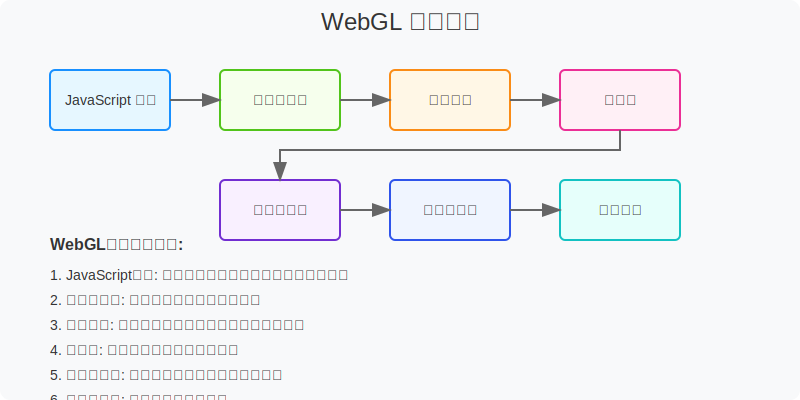
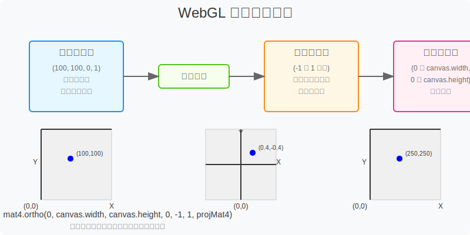
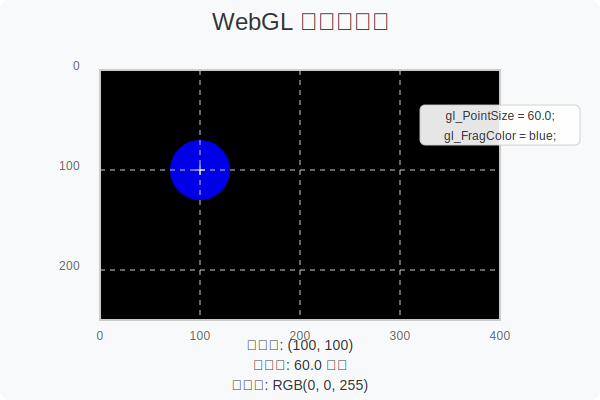

# WebGL Learning

这个仓库包含WebGL学习示例，展示了WebGL的基本概念和实现方法。

## 绘制点示例

### 概述

这个示例展示了如何使用WebGL绘制一个简单的点。示例中使用了顶点着色器和片元着色器来定义点的位置和颜色，并使用投影矩阵将点映射到屏幕坐标系统中。

### 技术栈

- WebGL - 用于在网页上渲染3D图形的JavaScript API
- glMatrix - 用于矩阵运算的JavaScript库
- HTML5 Canvas - 用于绘制图形的HTML元素

### WebGL渲染管线

1. **顶点着色器 (Vertex Shader)**：处理每个顶点的位置和属性
2. **图元装配 (Primitive Assembly)**：将顶点组装成图元（点、线、三角形）
3. **光栅化 (Rasterization)**：将图元转换为片元（像素）
4. **片元着色器 (Fragment Shader)**：处理每个片元的颜色和其他属性
5. **帧缓冲操作 (Framebuffer Operations)**：将片元写入帧缓冲区





*图1: WebGL渲染管线流程图，展示了从JavaScript代码到屏幕显示的数据流过程*
*图2: WebGL坐标系统示意图，展示了不同坐标空间之间的转换关系*
*图3: 点的渲染过程示意图，展示了如何在WebGL中绘制一个点*

### 代码结构

```
绘制点/
  ├── glMatrix-0.9.6.min.js  # 矩阵运算库
  └── 绘制点.html            # 主要的HTML和JavaScript代码
```

### 实现步骤

1. **初始化WebGL上下文**
   ```javascript
   let webglcanvas = document.getElementById("webglcanvas");
   gl = webglcanvas.getContext("webgl");
   ```

2. **设置视口和投影矩阵**
   ```javascript
   gl.viewport(0, 0, webglcanvas.width, webglcanvas.height);
   mat4.ortho(0, webglcanvas.clientWidth, webglcanvas.clientHeight, 0, -1, 1, projMat4);
   ```

3. **定义和编译着色器**
   - 顶点着色器：定义点的位置
   - 片元着色器：定义点的颜色

4. **创建和链接着色器程序**
   ```javascript
   let program = gl.createProgram();
   gl.attachShader(program, vsshader);
   gl.attachShader(program, fssagder);
   gl.linkProgram(program);
   gl.useProgram(program);
   ```

5. **设置顶点数据和属性**
   ```javascript
   let pointPosition = new Float32Array([100.0, 100.0, 0.0, 1.0]);
   let aPosition = gl.getAttribLocation(gl.program, "a_Position");
   gl.vertexAttrib4fv(aPosition, pointPosition);
   ```

6. **传递投影矩阵到着色器**
   ```javascript
   let uniformProj = gl.getUniformLocation(gl.program, "u_ProjMatrix");
   gl.uniformMatrix4fv(uniformProj, false, projMat4);
   ```

7. **绘制点**
   ```javascript
   gl.clearColor(0.0, 0.0, 0.0, 1.0);
   gl.clear(gl.COLOR_BUFFER_BIT);
   gl.drawArrays(gl.POINTS, 0, 1);
   ```

### 坐标系统

在这个示例中，我们使用了正交投影矩阵将WebGL的标准化设备坐标（NDC）转换为屏幕坐标。正交投影矩阵的参数如下：

```javascript

### 着色器代码

**顶点着色器**：
```glsl
// 一个点的坐标
attribute vec4 a_Position;
// 承接投影坐标系
uniform mat4 u_ProjMatrix;
void main() {
    // 计算点的坐标(顶点着色器)
    gl_Position = u_ProjMatrix * a_Position;
    gl_PointSize = 60.0;
}
```

**片元着色器**：
```glsl
void main() {
    // 绘制点的颜色
    gl_FragColor = vec4(0.0, 0.0, 1.0, 1.0);
}
```

### 运行示例

打开`绘制点/绘制点.html`文件在浏览器中查看示例。你应该能看到一个蓝色的点显示在画布上。

### 学习资源

- [WebGL官方文档](https://www.khronos.org/webgl/)
- [WebGL基础教程](https://developer.mozilla.org/zh-CN/docs/Web/API/WebGL_API/Tutorial)
- [glMatrix文档](http://glmatrix.net/)